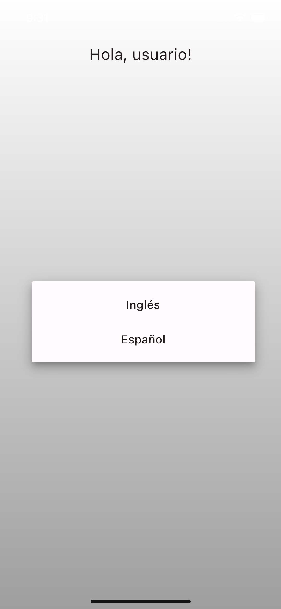

# Flutter Localization App

Luke's Localization App for CyberNinja.

## Getting Started

This is a simple Flutter mobile app that demonstrates some Flutter localization functionality. It is just one welcome screen with the label "Hello, user!" and a drop down with two languages - "English" and "Spanish". Switching the language will apply the selected language to the app.  

Next steps would be saving the users language preference in the device cache using SharedPreferences, Hive, or similiar tool.  This version simply defaults to English on app start.

To create I used the flutter [docs](https://docs.flutter.dev/accessibility-and-localization/internationalization#adding-your-own-localized-messages) to implement internationalizing our own localized messages. For state management I used the simple but effective setState method paired with a Stateful class. If more complexity was desired we could also implement with GetX or BLOC pattern.

## Running locally

Simply clone this public repository and run with your choice of IDE on an emulator or simulator.

